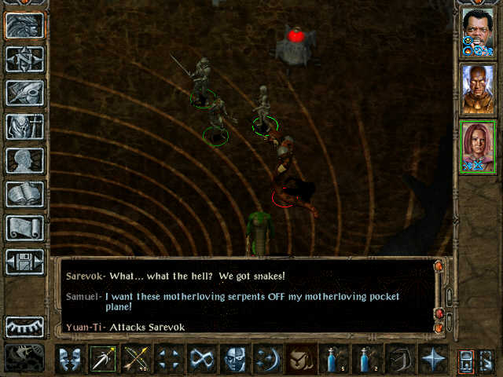

<a name="top" id="top">

<h1></a>The Slithering Menace (WIP)</h1>

<h3>A mod hosted by Spellhold Studios for Baldur's Gate II: Throne of Bhaal (classical and EE games),
Baldur's Gate Trilogy and EET<h3>

 

**Original Author:** vilkacis  
**Mod Website and Forum:** <a href="http://www.shsforums.net/topic/24421-the-slithering-menace-tob-only-v34/">Spellhold Studios</a>  

<a href="#intro">Overview</a> &#x2B25; <a href="#compat">Compatibility</a> &#x2B25; <a href="#installation">Installation</a> &#x2B25; <a href="#components">Components</a> &#x2B25; <a href="#screenshots">Screenshots</a> &#x2B25; <a href="#credits">Credits</a> &#x2B25; <a href="#versions">Versions History</a>
 

## Overview

This mod is a very serious (or not...) attempt to make Throne of Bhaal more interesting. It adds a small "quest" containing sn... *an encounter of serpentine nature* on the pocket pl... *dimension*, as well as a brand new (and stylish!) item.

I doubt I'm the first person to get the idea, but I have never actually seen it done before. :grinning:

## Compatibility

This mod is designed to work on the following Infinity Engine games: the original Baldur's Gate II (BG2 or just SoA) with the Throne of Bhaal (ToB) expansion, Baldur's Gate II: Enhanced Edition (BG2EE), the conversion projects Baldur's Gate Trilogy (BGT) and Enhanced Edition Trilogy (EET).

This is a WeiDU mod, and therefore should be compatible with all WeiDU mods. If you encounter any bugs, please report them on the forum! 

<a href="#top">Back to top</a>

## Installation

#### Notes

<em>If you've previously installed the mod, remove it before extracting the new version. To do this, run **setup-snakes.exe**, uninstall the previously installed main component and delete the :file_folder: snakes folder.</em>

<em>When installing or uninstalling, **do not close the DOS window** by clicking on the **X** button! Instead, press the **Enter** key whenever instructed to do so.</em>

**Disable any antivirus** or other memory-resident software before installing this or any other mod. Some (particularly avast and Norton!) have a tendency to report false positives with mod activity, resulting in failed installs.

## 

#### Enhanced Editions Note

The Enhanced Editions are actively supported games. Please note that every patch update will wipe your current mod setup! If in the middle of a modded game you might want to delay the patch update (if possible) as even after reinstalling the mods, you might not be able to continue with your old savegames. Alternatively, copy the whole game's folder into a new one that can be modded and will stay untouched by game patches. It is important that you install the mod to the language version you are playing the game in. Otherwise, the dialogues of the mod will not show but give error messages.

## 

#### Windows

Extract the contents of the mod archive into the folder of the game you wish to modify (<em>the folder which contains the "CHITIN.KEY" file</em>), using <a href="http://www.7-zip.org/download.html">7zip</a>, <a href="http://www.rarlab.com/download.htm">WinRAR</a>, or another file compression utility that handles .zip files. On successful extraction, there should be a :file_folder: snakes folder and a setup-snakes.exe file in your game folder. To install, simply double-click **setup-snakes.exe** and follow the instructions on screen.

Run **setup-snakes.exe** in your game folder to reinstall, uninstall or otherwise change the component settings.

## 

#### Note for Complete Uninstallation

In addition to the methods above for removing individual components, you can completely uninstall the mod using **`setup-snakes --uninstall`** at the command line to remove all components without wading through prompts. 

<a href="#top">Back to top</a>

## Components

The installer includes one single component, the main component.

How to play

 
In order to play this mod, there are three things you must do:
<ul>
<il>You must have Imoen in your party,</il>
<il>You must have finished your negotiations with Sarevok's wraith, and</il>
<il>You must be in the pocket plane.</il>
<ul>

Once these conditions are met, the "quest" will start automatically in a few moments. You should not need to start a new game.

<a href="#top">Back to top</a>

## Screenshots

I you haven't even seen the film yet... :wink: 

Other <a href="http://crack.prositen.com/SNAKES/SNAKES.html">screenshots</a>.

<a href="#top">Back to top</a>

## Credits and Acknowledgements

#### Author: <a href="http://www.shsforums.net/user/6209-vilkacis/">vilkacis</a>

#### Special Acknowledgements to:

- Gwendolyne: Released version 4.0.0.
- Deratiseur: Provided the EE compatible version (3.5).
- Clan REO team: Provided Spanish translation.
- La Voix 2 la Sagesse (of the d'Oghmatiques) : Provided French translation.
- Giuseppe: Provided Italian translation.
- Gerri: Provided German translation.
- Casso & aerie.ru team: Provided Russian translation.

If you wish to translate the mod, have a suggestion, or should encounter any bugs, please report them to the maintainers at the <a href="http://www.shsforums.net/topic/24421-the-slithering-menace-tob-only-v34/">mod forum</a>. 

#### Copyrights Information

###### The Slithering Menace is not developed, supported, or endorsed by BioWare&trade; or Interplay/BlackIsle, Overhaul, Beamdog or the Wizards of the Coast. It was developed by vilkacis, based on material from the game Baldur's Gate II and its expansion.
###### Baldur's Gate II: Shadows of Amn and Baldur's Gate II: Throne of Bhaal &copy; TSR, Inc. The BioWare Infinity Engine is &copy; BioWare Corp. All other trademarks and copyrights are property of their respective owners.
###### All other trademarks and copyrights are the property of their respective owners. 

<a href="#top">Back to top</a>

## Versions History

##### Version 4.0.0 (, 2019)

- Renamed Setup-SNAKES.tp2 -> snakes.tp2 to support AL|EN's "Project Infinity".
- Added snakes.ini metadata file to support AL|EN's "Project Infinity".
- Fixed Snake-skin loafers (jl#shoes.itm): Added opcodes #267 Protection from Display Specific String (14000 "Slow" and 14668 "Slowed") and #169 Immunity Special Effect Icon (41 Slow).
- Added ADD_JOURNAL new WeiDU command for EE games.
- Revamped script jl#snakes.baf: Replaced old-school trigger conditions !StateCheck("XXX",STATE_SLEEPING) with me accurate !StateCheck("XXX",CD_STATE_NOTVALID).
- Revamped jl#snakes.d: Replaced old-school ~IsValidForPartyDialogue("XXX")~ conditions with more accurate ~InParty("XXX") InMyArea("XXX") !StateCheck("XXX",CD_STATE_NOTVALID)~ and all APPEND banter files with CHAIN.
- Added missing jl#snakes.tra file in HANDLE_CHARSETS array function.
- Reorganized mod architecture tree: created or renamed folders to sort files according to their types.
- Reorganized component (DESIGNATED number).
- Added REQUIRE_PREDICATE process to avoid installing the mod in inaccurate games.
- Replaced AUTHOR keyword with SUPPORT.
- Added VERSION flag
- Updated and renamed readme files to <em>snakes-readme-%LANGUAGE%</em>.
- Updated translations (Gwendolyne).

## 

##### Version 3.5 (July 31, 2019)

- Added BG2EE compatibility by Deratiseur.
- Updated WeiDU installer to v246.

## 

##### Version 3.4 (August 8, 2009)

- Added Spanish translation by Clan REO.

## 

##### Version 3.3 (October 27, 2008)

 - Fixed a typo in tp2 AUTO_TRA line that prevented the mod to be installed properly.

## 

##### Version 3.2 (September 12, 2008)

- Added French translation by La Voix 2 la Sagesse (of the d'Oghmatiques)!
- Updated WeiDU installer.

## 

##### Version 3.1 ??? (July 13, 2008)

- Added Italian translation by Giuseppe.

## 

##### Version ??? (April 13, 2008)

- Added German translation by Gerri.

## 

##### Version 2.1 ??? (February 14, 2008)

- Added Russian translation by Casso & aerie.ru team.

## 

##### Version ??? (April 25, 2007)

- Updated dialogs.

## 

##### Version ??? (March 9, 2007)

## 

##### Version 1 (January 26, 2007) 21 8 2006

- Initial release.

<a href="#top">Back to top</a>

